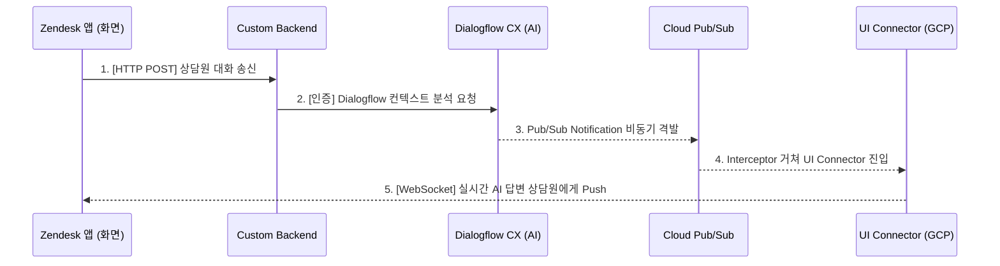

# Google Cloud Agent Assist - Zendesk Integration Guide (Sample)

> [!NOTE]
> **[주의] 본 리포지토리는 구글 클라우드 공식 에이전트 어시스트와의 연동 시험을 돕기 위해 작성된 백엔드/프록시 가이드용 샘플 코드입니다.**

구글의 공식 이벤트 스트리밍 규격(`aa-integration-backend`)에 기반하여 구현된, Zendesk-Agent Assist 프록시 미들웨어의 레퍼런스 구성 안내서입니다.

---

## 1. 아키텍처 개요 (System Architecture)

본 시스템은 대화 분석이 백그라운드 비동기 이벤트로 가동되는 **이벤트 기반(Event-Driven) 설계**를 따릅니다.

### 🔄 전체 데이터 흐름 (Data Flow)

