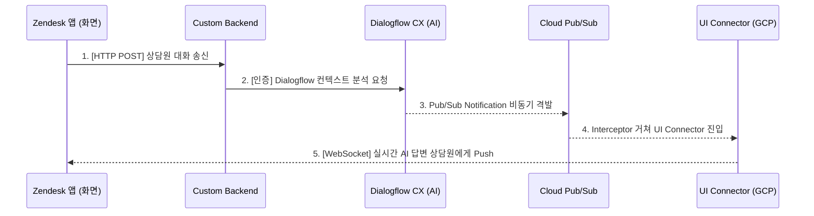

# Google Cloud Agent Assist - Zendesk Integration Guide (Standard)

구글의 공식 이벤트 스트리밍 규격(`aa-integration-backend`)에 기반하여 구현된, Zendesk-Agent Assist 프록시 미들웨어의 레퍼런스 구성 안내서입니다.

---

## 1. 아키텍처 개요 (System Architecture)

본 시스템은 동기식 응답 대기 구조를 탈피하고, 대화 분석이 백그라운드 이벤트로 가동되는 **이벤트 기반(Event-Driven) 설계**를 따릅니다.

### 🔄 전체 데이터 흐름 (Data Flow)


---

## 2. 보안 체계 및 규격

### 🔒 인증 메커니즘 (Double-Lock Authentication)
1.  **사내 SSO (eTrust):** 상담사의 초기 진입 검증 및 세션 관리는 사내 통합 인증 시스템(eTrust)의 검증 API를 통해 승인됩니다.
2.  **구글 서비스 계정 (Service Account):** 플랫폼 간 권한 획득(백채널 API 통신) 용도로 JSON 비밀키를 미들웨어 구동 런타임에 삽입합니다.

---

## 3. 구축 및 실행 단계 (Getting Started)

### 💻 Environment Variables 설정
미들웨어 구동을 위해 시스템 환경변수에 아래 정보가 주입되어야 합니다.
```bash
export GOOGLE_APPLICATION_CREDENTIALS="./google-account-key.json"
```

### 💻 패키지 기동
```bash
npm install
node server.js
```

---

## 4. 환경 변수 대체 규격
코드 내 다음 값들은 고객사의 GCP 인프라 명세에 맞춰 완전 대체되어야 합니다.
*   `your-gcp-project-id`
*   `https://<your-ui-connector-url>`
