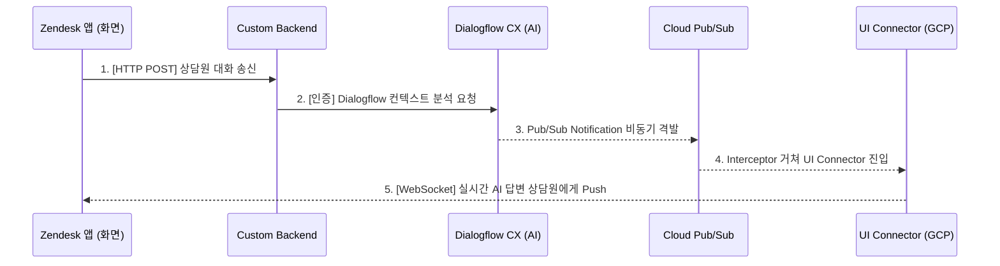

# Google Cloud Agent Assist - Zendesk Integration Guide (Sample)

> [!NOTE]
> **[주의] 본 리포지토리는 구글 클라우드 공식 에이전트 어시스트와의 연동 시험을 돕기 위해 작성된 백엔드/프록시 가이드용 샘플 코드입니다.**

Google Cloud Agent Assist Integration Backend 가이드 기반으로 구현된, Zendesk-Agent Assist 프록시 미들웨어의 레퍼런스 구성 안내서입니다.

---

## 아키텍처 개요 (System Architecture)

본 시스템은 대화 분석이 백그라운드 비동기 이벤트로 가동되는 **이벤트 기반(Event-Driven) 설계**를 따릅니다.

### 🔄 전체 데이터 흐름 (Data Flow)


---

## 1. 참고 문서 (Reference Documentation)

### 🔗 Google Cloud Agent Assist Integration Backend 가이드
*   [GitHub 레포지토리](https://github.com/GoogleCloudPlatform/agent-assist-integrations/tree/HEAD/aa-integration-backend)
*   **설명:** 구글에서 제공하는 Agent Assist 통합 백엔드(UI-Connector, Interceptor 등)의 소스 코드와 아키텍처 설명이 포함되어 있습니다. 인프라 수준의 보안 설정이나 고급 환경 변수 설정을 바꿀 때 참고하세요.

### 🔗 Zendesk 개발자 가이드 (ZAF Client API)
*   [Zendesk Apps Framework 공식 문서](https://developer.zendesk.com/documentation/apps/)
*   **설명:** 젠데스크 사이드바 앱을 개발할 때 사용하는 ZAF(Zendesk Apps Framework)의 기능과 API 레퍼런스입니다. 상담사 화면의 이벤트를 감지하거나 데이터를 읽어오는 등 앱의 기능을 확장할 때 참고하세요.

---

## 2. 설정 및 실행 방법

젠데스크와 구글 Agent Assist를 연동하기 위한 단계별 가이드입니다. 천천히 따라 해 보세요!

### ⚙️ 1단계: 백엔드 서버 설정 및 배포
이 서버(Node.js)는 젠데스크 앱의 화면을 보여주고, 대화 세션을 관리하는 역할을 합니다.

1. 먼저 필요한 라이브러리를 설치해야 합니다. 터미널에서 프로젝트 폴더로 이동 후 아래 명령어를 실행하세요.
   ```bash
   npm install
   ```
2. `server.js` 파일의 상단에 있는 **GCP 설정 정보**를 본인의 환경에 맞게 수정합니다.
   ```javascript
   const PROJECT_ID = 'your-gcp-project-id'; // 본인의 GCP 프로젝트 ID
   const LOCATION = 'global'; // 리전 (기본값 global)
   const CONVERSATION_PROFILE = 'projects/your-gcp-project-id/locations/global/conversationProfiles/your-profile-id'; // 생성한 컨버세이션 프로필 ID
   ```
3. 수정한 서버 코드를 **Google Cloud Run** 등에 배포합니다.
   * 배포가 완료되면 생성되는 **서비스 URL**(예: `https://your-backend-...run.app`)을 복사하여 메모장에 잘 적어두세요.

### ⚙️ 2단계: UI-Connector 주소 연동
젠데스크 화면이 실시간으로 AI 추천을 받아오려면 이미 떠 있는 `UI-Connector` 서버와 연결되어야 합니다.

1. `public/zendesk/app.js` 파일을 엽니다.
2. 상단의 `connectorUrl` 변수에 **이미 배포되어 있는 UI Connector의 주소**를 입력합니다.
   ```javascript
   const connectorUrl = 'https://<your-ui-connector-url>';
   ```

### ⚙️ 3단계: 젠데스크 앱 패키징 및 업로드

1. `zendesk-app` 폴더로 이동합니다.
2. `manifest.json` 파일을 열고, `ticket_sidebar` 항목의 URL을 **1단계에서 배포한 백엔드 서버의 주소**로 수정합니다.
   ```json
   "location": {
     "support": {
       "ticket_sidebar": "https://<your-backend-url>/zendesk/index.html"
     }
   },
   "domainWhitelist": ["<your-backend-domain-only>"] // 예: your-backend-...run.app
   ```
3. **ZIP 파일 만들기:**
   * `zendesk-app` **폴더 자체를 우클릭해서 압축하시면 안 됩니다!**
   * 반드시 `zendesk-app` 폴더 **안으로 들어가서** `manifest.json` 파일과 `assets` 폴더 등 **내용물들을 한꺼번에 드래그하여** ZIP 파일로 압축해 주세요.
4. 젠데스크 관리자 화면(`관리자 센터`)에 접속합니다.
5. `앱 및 통합` -> `Zendesk 통합 앱` -> `앱 업로드` 메뉴로 이동합니다.
6. 방금 만든 ZIP 파일을 선택하고 업로드하면 모든 설정이 끝납니다!

---

## 🚫 특이사항: 수동 트리거 방식

현재 버전은 실시간 대화 캡처(감지) 대신 **[AI 추천 직접 받기] 버튼을 누르는 수동 트리거 방식**으로 구현되어 있습니다.

*   **이유:** 대화 이벤트를 실시간으로 가로채서 구글 API를 호출하는 복잡한 연동을 배제하고, Agent Assist가 정상적으로 답변을 생성하고 화면에 잘 뿌려주는지(UI/UX)를 먼저 검증하기 위함입니다.
*   **상용화 시 개선 방향:** 젠데스크의 채팅 입력창 이벤트나 메시지 수신 이벤트를 구독하여, 버튼 클릭 없이도 **실시간으로 AI 추천이 자동 갱신**되도록 고도화해야 합니다.
