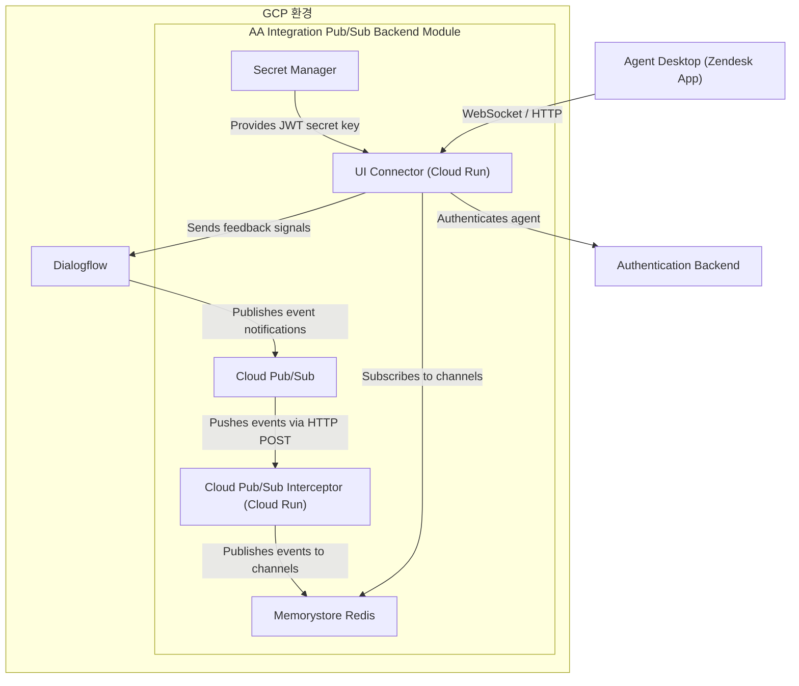

# Google Cloud Agent Assist - Zendesk Integration

이 프로젝트는 Google Cloud의 Agent Assist(AI 추천) 기능을 Zendesk의 사이드바 앱으로 연동하기 위한 솔루션입니다. 상담사가 고객과 대화할 때 실시간으로 AI가 최적의 답변이나 가이드를 추천해 줍니다.

## 🏗 아키텍처 특징: 왜 서버 사이드(Remote Hosted) 방식인가?

본 앱은 Zendesk 내부에 모든 소스코드를 포함하는 클라이언트 사이드 방식이 아닌, **외부 서버(Google Cloud Run)에 소스를 올리고 Zendesk는 이를 읽어가는 Remote Hosted 방식**으로 구현되었습니다.

**이유 및 장점:**
1. **유지보수의 용이성:** 기능 개선이나 버그 수정 시 젠데스크에 앱을 매번 다시 빌드해서 업로드할 필요 없이, 백엔드 서버만 업데이트하면 즉시 반영됩니다.
2. **보안성:** 복잡한 통신 및 인증 로직을 서버 사이드에서 안전하게 처리할 수 있습니다.
3. **성능 및 확장성:** 무거운 라이브러리나 복잡한 파싱 로직을 서버에서 처리하여 젠데스크 화면의 부하를 줄입니다.

---

## 📐 시스템 아키텍처 및 흐름도

이 솔루션의 전체적인 아키텍처와 데이터 흐름은 다음과 같습니다. (공식 Google 가이드 기준)



**💡 데이터 흐름 설명:**
1. **이벤트 발생:** 고객과 대화 중 AI 추천이 생성되면 **Dialogflow**가 이벤트를 **Cloud Pub/Sub**으로 발행합니다.
2. **이벤트 전달:** **Pub/Sub**은 등록된 푸시 구독을 통해 **Cloud Pub/Sub Interceptor**로 이벤트를 밀어줍니다(HTTP POST).
3. **채널 브로커 (Redis):** **Interceptor**는 이벤트를 **Memorystore Redis**의 Pub/Sub 채널에 발행합니다.
4. **실시간 전송:** **UI Connector**는 Redis 채널을 구독하고 있다가, 해당 이벤트를 연결된 **Zendesk 앱(Agent Desktop)**으로 웹소켓을 통해 실시간으로 전송합니다.
5. **인증 및 피드백:** **UI Connector**는 **Secret Manager**의 JWT 키를 이용해 인증을 처리하고, 사용자의 피드백 신호를 **Dialogflow**로 다시 전달합니다.

---

## 📋 사전 준비 사항

1. **Google Cloud Platform (GCP) 계정** 및 프로젝트
2. **Agent Assist 설정:**
   * Dialogflow 스토리가 구성되어 있어야 합니다.
   * Conversation Profile ID가 필요합니다.
3. **Zendesk 계정:** 앱을 업로드할 수 있는 관리자 권한이 필요합니다.

---

## 📚 관련 문서 및 참고 링크

솔루션의 심화 이해 및 커스터마이징을 위해 아래 공식 가이드 문서를 참고하시는 것을 강력히 권장합니다.

1. **Google Cloud Agent Assist Integration Backend 가이드**
   * [GitHub 공식 레포지토리](https://github.com/GoogleCloudPlatform/agent-assist-integrations/tree/HEAD/aa-integration-backend)
   * **설명:** 구글에서 제공하는 Agent Assist 통합 백엔드(UI-Connector, Interceptor 등)의 공식 소스 코드와 아키텍처 설명이 포함되어 있습니다. 인프라 수준의 보안 설정이나 고급 환경 변수 설정을 바꿀 때 참고하세요.
2. **Zendesk 개발자 가이드 (ZAF Client API)**
   * [Zendesk Apps Framework 공식 문서](https://developer.zendesk.com/documentation/apps/)
   * **설명:** 젠데스크 사이드바 앱을 개발할 때 사용하는 ZAF(Zendesk Apps Framework)의 기능과 API 레퍼런스입니다. 상담사 화면의 이벤트를 감지하거나 데이터를 읽어오는 등 앱의 기능을 확장할 때 참고하세요.

---

## 🚀 차근차근 따라 하는 설정 및 실행 방법

젠데스크와 구글 Agent Assist를 연동하기 위한 단계별 가이드입니다. 천천히 따라 해 보세요!

### 1단계: 백엔드 서버 설정 및 배포

이 서버(Node.js)는 젠데스크 앱의 화면을 보여주고, 대화 세션을 관리하는 역할을 합니다.

1. 먼저 필요한 라이브러리를 설치해야 합니다. 터미널에서 프로젝트 폴더로 이동 후 아래 명령어를 실행하세요.
   ```bash
   npm install
   ```
2. `server.js` 파일의 상단에 있는 **GCP 설정 정보**를 본인의 환경에 맞게 수정합니다.
   ```javascript
   const PROJECT_ID = 'your-gcp-project-id'; // 본인의 GCP 프로젝트 ID
   const LOCATION = 'global'; // 리전 (기본값 global)
   const CONVERSATION_PROFILE = 'projects/your-gcp-project-id/locations/global/conversationProfiles/your-profile-id'; // 생성한 컨버세이션 프로필 ID
   ```
3. 수정한 서버 코드를 **Google Cloud Run** 등에 배포합니다.
   * 배포가 완료되면 생성되는 **서비스 URL**(예: `https://your-backend-...run.app`)을 복사하여 메모장에 잘 적어두세요.

### 2단계: UI-Connector 주소 연동

젠데스크 화면이 실시간으로 AI 추천을 받아오려면 이미 떠 있는 `UI-Connector` 서버와 연결되어야 합니다.

1. `public/zendesk/app.js` 파일을 엽니다.
2. 상단의 `connectorUrl` 변수에 **이미 배포되어 있는 UI Connector의 주소**를 입력합니다.
   ```javascript
   const connectorUrl = 'https://<your-ui-connector-url>';
   ```

### 3단계: 젠데스크 앱 패키징 및 업로드 (★가장 중요)

젠데스크 시스템에는 대용량 소스 코드를 올릴 필요가 없습니다. **"우리 서버를 바라보라"는 명함(설정 파일)**만 묶어서 올려주시면 됩니다.

1. `zendesk-app` 폴더로 이동합니다.
2. `manifest.json` 파일을 열고, `ticket_sidebar` 항목의 URL을 **1단계에서 배포한 백엔드 서버의 주소**로 수정합니다.
   ```json
   "location": {
     "support": {
       "ticket_sidebar": "https://<your-backend-url>/zendesk/index.html"
     }
   },
   "domainWhitelist": ["<your-backend-domain-only>"] // 예: your-backend-...run.app
   ```
3. **[🚨 절대 주의] ZIP 파일 만들기:**
   * `zendesk-app` **폴더 자체를 우클릭해서 압축하시면 안 됩니다!**
   * 반드시 `zendesk-app` 폴더 **안으로 들어가서** `manifest.json` 파일과 `assets` 폴더 등 **내용물들을 한꺼번에 드래그하여** ZIP 파일로 압축해 주세요.
4. 젠데스크 관리자 화면(`관리자 센터`)에 접속합니다.
5. `앱 및 통합` -> `Zendesk 통합 앱` -> `앱 업로드` 메뉴로 이동합니다.
6. 방금 만든 ZIP 파일을 선택하고 업로드하면 모든 설정이 끝납니다!

---

## ⚠️ PoC 단계의 특이사항: 수동 트리거 방식

현재 버전은 PoC(개념 검증)를 위해 실시간 대화 캡처(감지) 대신 **[AI 추천 직접 받기] 버튼을 누르는 수동 트리거 방식**으로 구현되어 있습니다.

* **이유:** 대화 이벤트를 실시간으로 가로채서 구글 API를 호출하는 복잡한 연동을 배제하고, Agent Assist가 정상적으로 답변을 생성하고 화면에 잘 뿌려주는지(UI/UX)를 먼저 검증하기 위함입니다.
* **상용화 시 개선 방향:** 젠데스크의 채팅 입력창 이벤트나 메시지 수신 이벤트를 구독하여, 버튼 클릭 없이도 **실시간으로 AI 추천이 자동 갱신**되도록 고도화해야 합니다.

---

## 🔐 보안 권고사항 (상용화 시)

현재 코드는 PoC(기술 검증) 수준으로, 상용화를 위해서는 다음 설정이 필요합니다.

1. **CORS 설정:** `ui-connector`의 `config.CORS_ALLOWED_ORIGINS`에 젠데스크 도메인만 허용하도록 제한하세요.
2. **인증 활성화:** 현재 `AUTH_OPTION=Skip`으로 되어 있는 부분을 고객사의 ID Provider(Salesforce 등)와 연동하여 JWT 인증을 활성화하세요.

---

## 📄 라이선스

이 프로젝트는 Google Cloud Platform Agent Assist 통합 가이드를 기반으로 제작되었습니다.
